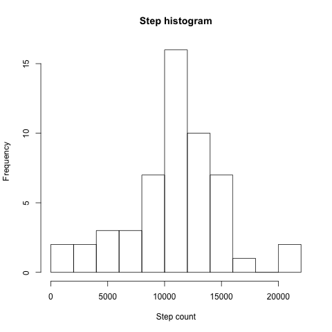
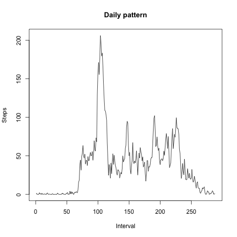
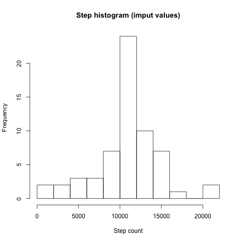
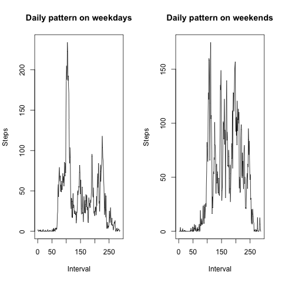

# Reproducible Research: Peer Assessment 1


## Loading and preprocessing the data

Data is loaded using simple ```read.csv``` call:

```r
data <- read.csv("activity.csv")

```

required libraries:

```r
require(plyr)
require(ggplot2)
```

## What is mean total number of steps taken per day?

Extract and summarize values by day, plot a histogram:

```r
daily <- ddply(data, ~date, summarise, steps = sum(steps))
png(filename = "steps_hist.png", width = 480, height = 480)
hist(daily$steps, breaks = 10, xlab = "Step count", main = "Step histogram")
dev.off()
```



find a mean and a median value:

```r
daily_mean <- mean(daily$steps, na.rm = TRUE)
daily_median <- median(daily$steps, na.rm = TRUE)

print(paste("Daily mean:", daily_mean))
print(paste("Daily median:", daily_median))
```

These values are: 

```r
[1] "Daily mean: 10766.1886792453"
[1] "Daily median: 10765"
```

## What is the average daily activity pattern?

Data is already split in 5 min intervals, so it's simple to process it:

```r
daily_pattern <- ddply(data, ~interval, summarize, steps = mean(steps, na.rm = TRUE))
png(filename = "daily_pattern.png", width = 480, height = 480)
plot(daily_pattern$steps, type = "l", ylab = "Steps", xlab = "Interval", main = "Daily pattern")
dev.off()

print(paste("Busiest interval:", daily_pattern$interval[which.max(daily_pattern$steps)]))
```



So, the busiest interval is 8:35 in the morning:

```r
[1] "Busiest interval: 835"
```


## Imputing missing values

There are a lot of missing vlaues in a dataset:

```r
print(paste("Number of empty values:", sum(is.na(data$steps))))
```

```r
[1] "Number of empty values: 2304"
```

To imput missing values, we iterate over intervals and replace NA with mean value for this interval. Mean value is cached (so new values do not mess the interval).

```r
steps <- data$steps
data_imput <- ddply(data, ~interval, function(interval) {
  mean_steps <- mean(interval$steps, na.rm = TRUE)
  interval$steps[is.na(interval$steps)] <- mean_steps
    
  interval
})

daily_imput <- ddply(data_imput, ~date, summarise, steps = sum(steps))

png(filename = "steps_hist_imput.png", width = 480, height = 480)
hist(daily_imput$steps, breaks = 10, xlab = "Step count", main = "Step histogram (imput values)")
dev.off()

daily_mean_imput <- mean(daily_imput$steps, na.rm = TRUE)
daily_median_imput <- median(daily_imput$steps, na.rm = TRUE)

print(paste("Daily mean (imput):", daily_mean_imput))
print(paste("Daily median (imput):", daily_median_imput))
```



Mean and median values are now equal:

```r
[1] "Daily mean (imput): 10766.1886792453"
[1] "Daily median (imput): 10766.1886792453"
```

## Are there differences in activity patterns between weekdays and weekends?

To find out, let's create separate column ```week_part```, fill it using ```weekdays```, and split and re-plot data based on this column:

```r
data$week_part <- sapply(data$date, function (date) {
  if (weekdays(date) %in% c("Saturday", "Sunday")) {
    return("weekend")
  } else {
    return("weekday")
  }
})

data_weekday <- subset(data, data$week_part == "weekday")
data_weekend <- subset(data, data$week_part == "weekend")

daily_pattern_weekday <- ddply(data_weekday, ~interval, summarize, steps = mean(steps, na.rm = TRUE))
daily_pattern_weekend <- ddply(data_weekend, ~interval, summarize, steps = mean(steps, na.rm = TRUE))

png(filename = "weekly_pattern.png", width = 480, height = 480)
par(mfrow = c(1,2))
plot(daily_pattern_weekday$steps, type = "l", ylab = "Steps", xlab = "Interval", main = "Daily pattern on weekdays")
plot(daily_pattern_weekend$steps, type = "l", ylab = "Steps", xlab = "Interval", main = "Daily pattern on weekends")
dev.off()
```

as you see, people are more active during daytime in the weekends, but still show almost the same activity in the mornings:


